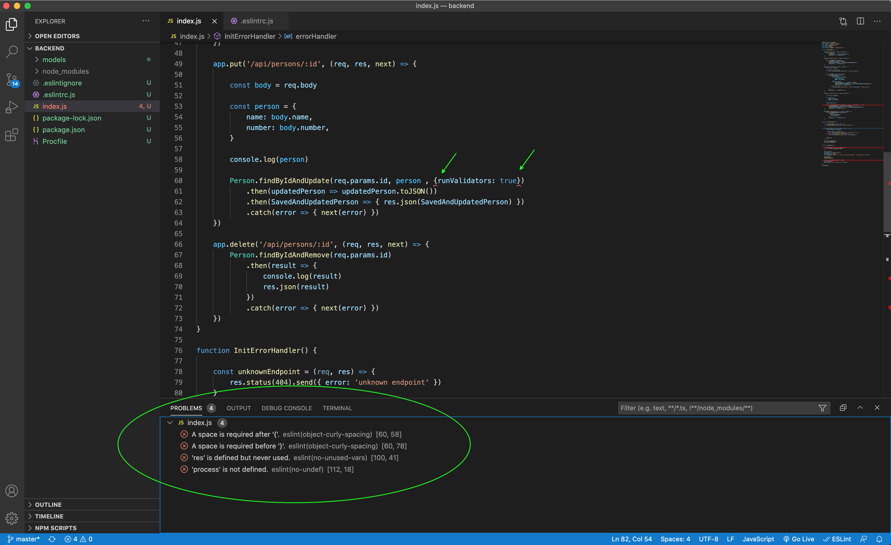

### I used Lint from both command line and visual studio code. It is very convenient to find out something wrong in my source code by using Lint. I fixed a few cases that are noticed by eslint in my backend project 3.21

